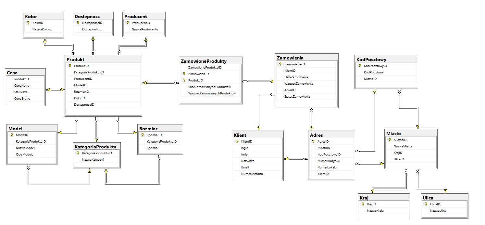

# Moje reporytorium
Jest to przykładowy projekt bazy danych sklepu z butami (można też dodawać inne produkty, jeśli doda się taką kategorię produktów i pasujące do niej rozmiary)

# Główny schemat bazy danych

# Opis procedury dodawania produktów

Procedura służy do dodania nowego towaru do bazy danych sklepu. Podczas jej wykonywania podawane są parametry:
- kategoria produktu
- producent
- model
- rozmiar
- kolor
- dostępna ilość
Baza danych jak i procedura jest tak zaprojektowana, aby nie dublować powtarzających się wpisów do tabeli np.
- dodane zostały 4 produkty, select wykazuję, że w przypadku wykorzystania tego samego istniejącego w DB koloru czy też modelu (w tej samej kategorii produktu) pobierane jest ID.
Rozmiar oraz model jest uzależniony od kategorii produktu.
Wywołanie procedury dla produktu istniejącego już w bazie danych powoduje zaktualizowanie (dodanie) stanów magazynowych o nową podaną wartość "dostępna ilość"
