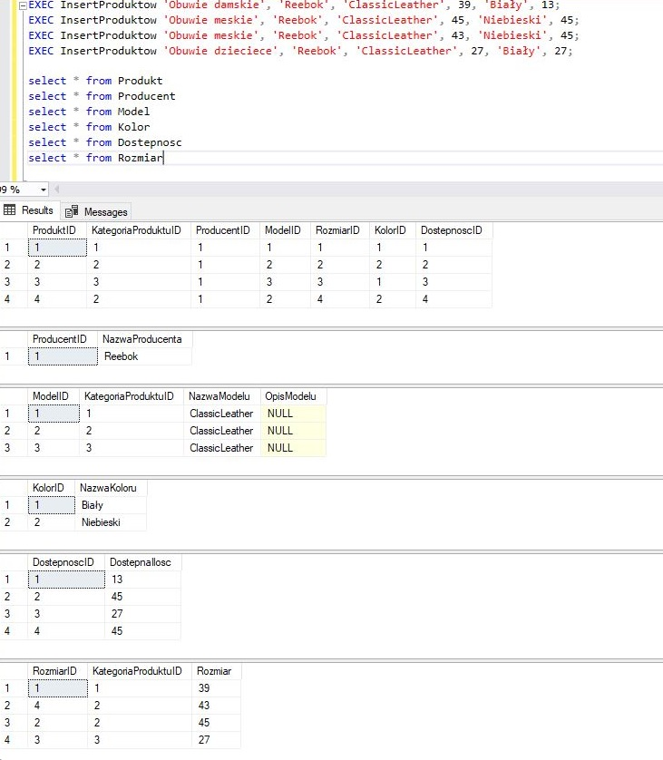

# Moje reporytorium
Jest to przykładowy projekt bazy danych sklepu z butami (można też dodawać inne produkty, jeśli doda się taką kategorię produktów i pasujące do niej rozmiary). Poniżej opis kilku ważniejszych procedur wykorzystanych w projekcie.

# Główny schemat bazy danych

# Opis procedury dodawania produktów

Procedura służy do dodania nowego towaru do bazy danych sklepu. Podczas jej wykonywania podawane są parametry:
- kategoria produktu
- producent
- model
- rozmiar
- kolor
- dostępna ilość

Baza danych jak i procedura jest tak zaprojektowana, aby nie dublować powtarzających się wpisów do tabeli np.
- dodane zostały 4 produkty, select wykazuję, że w przypadku wykorzystania tego samego istniejącego w DB koloru czy też modelu (w tej samej kategorii produktu) pobierane jest ID.
Rozmiar oraz model jest uzależniony od kategorii produktu.
Wywołanie procedury dla produktu istniejącego już w bazie danych powoduje zaktualizowanie (dodanie) stanów magazynowych o nową podaną wartość "dostępna ilość"

# Opis procedury dodawania ceny

Procedura służy do dodawania ceny netto produktu w danym modelu w danej kategorii produktu. Wykorzystywana jest w aplikacji GUI na oknie dodawania/aktualizowania ceny do wybranych produktów.
Procedura zaprojektowana została tak, że jeżeli istnieje już przypisana cena do danego produktu, to zostaje ona zaktualizowana.

# Opis procedury dodawania opisu

Procedura służy do dodawania opisu danego modelu, niezależnie od kategorii produktu. Jest to bardziej sensowne rozwiązanie, niż tworzenie opisów podczas dodawania nowych produktów, ponieważ nie będzie trzeba wklejac opisu wielokrotnie dla każdego wariantu (koloru, rozmiaru...). Procedura jest wspierana przez procedurę "procedura wyboru modelu 3 dla okna dodaj opis.sql" w aplikacji GUI, która ujednolica wybór modelu z listy rozwijanej, tak aby model nie powtarzał się, mimo że wystepuje w kilku kategoriach produktu.

# Opis procedury dodawania klienta

Procedura służy do dodawania klienta wraz z jego danymi adresowymi oraz kontaktowymi. Baza danych jak i procedura jest tak zaprojektowana, aby nie dublować powtarzających się wpisów do tabeli np.
- kiedy miasto istnieje pobierane jest jego ID, jeśli nie istnieje to je dodaje i pobiera ID
- kiedy kraj istnieje pobierane jest jego ID, jeśli nie istnieje to je dodaje i pobiera ID
- nazwa ulicy się nie powtarza, może występowac w wielu Miastach, jednak zastosowana relacja umożliwia znajdywanie właściwego miasta dla danego klienta, jeśli nie istnieje to je dodaje i pobiera ID
- kod pocztowy się nie powtarza, jest zależny od miasta, prostym selectem można odszukać wszystkie kody pocztowe w danym mieście, jeśli nie istnieje to je dodaje i pobiera ID
Dodatkowo procedura wymusza unikalność loginów i adresów email. Dodatkowo wymuszany jest format kodu pocztowego.
